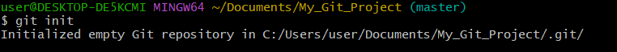
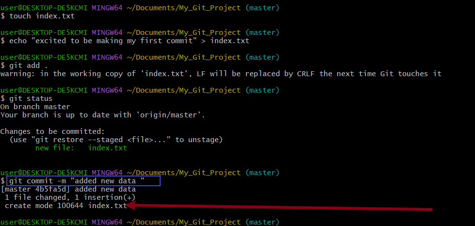
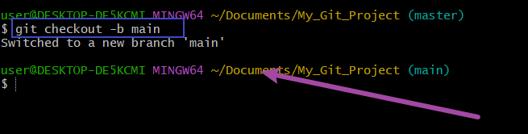
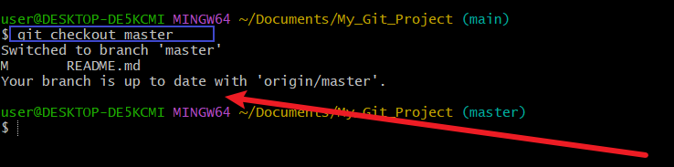
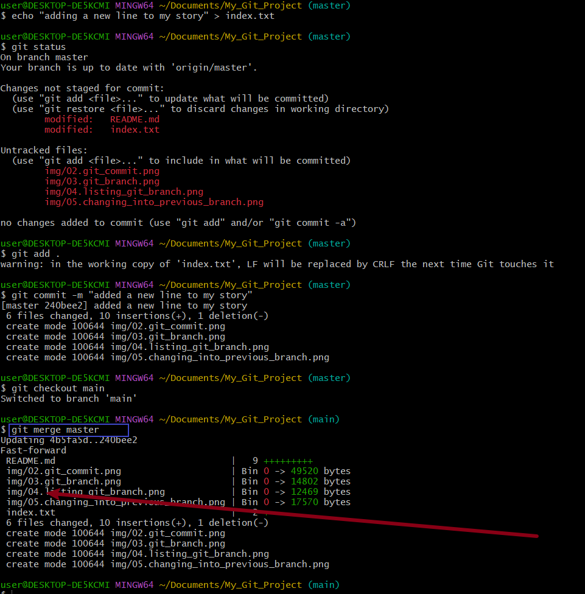
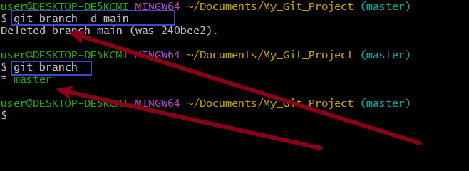
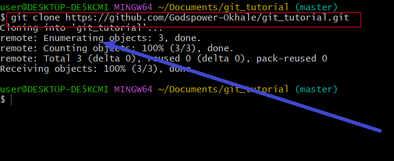

# What is Git

Git is a free and open source distributed version control system designed to handle everything from small to very large projects with speed and efficiency.

## git init

The git init command creates a new Git repository. It can be used to convert an existing, unversioned project to a Git repository or initialize a new, empty repository.

To run the command, the synthax is `git init`

## Git Commit

The "commit" command is used to save your changes to the local repository. Note that you have to explicitly tell Git which changes you want to include in a commit before running the "git commit" command. This means that a file won't be automatically included in the next commit just because it was changed.

The synthax is `git commit -m "initial message"`

## Git Branch

Git branch helps you create a differnet copy of your source code. In your new branch you can make changes as you please. the changes will be independent of what is available in the main copy. Git branch is also an important tools for collaborating within remote team.

To create a new branch you can use the following synthax `git checkout -b branch_name`

## Listing git branch

use the command bellow to list the branches in your local git directory `git branch`

## changing into previous branch

To change into an old branch use the following command
`git checkout branch_name`

## git merge

Let say we have two branches A and B,and we want to add the contents of B into A,first we change into branch A and run the following command `git merge B`

## deleting git branch

Git branch can be deleted with the following command `git branch -d brach_name`

## git clone

The git clone command help us make a copy of our remote repository in our local machine. see it as a git tool for downloading remote repository to our local machine.

The command is `git clone <the link to your remote repository>`

